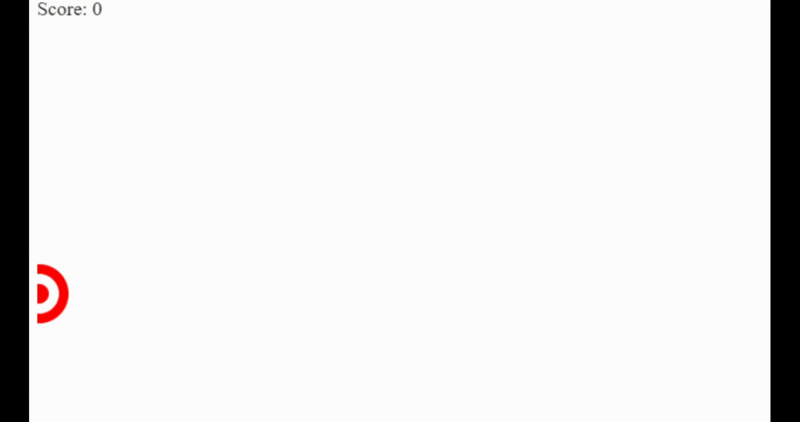

# Tiro ao alvo JS 

Joguinho em html para testar a mira

## 🚀 Começando

Abrir o arquivo que o jogo será aberto no navegador, ao clicar no centro o score aumenta em 1

### 📋 Pré-requisitos

Um nevegador web

## 🎯 Demonstração

## 🖇️ Colaborando

Por favor, se deseja coloborar enviar e-mail para bruno.gdscosta@gmail.com

## ✒️ Autores

Mencione todos aqueles que ajudaram a levantar o projeto desde o seu início

* **Bruno Gabriel dos Santos Costa** - *Todo o trabalho* - [Bruno Gabriel](https://github.com/Bruno-Gdos)

---
⌨️ com ❤️ por [Bruno Gabriel](https://github.com/Bruno-Gdos) 😊
